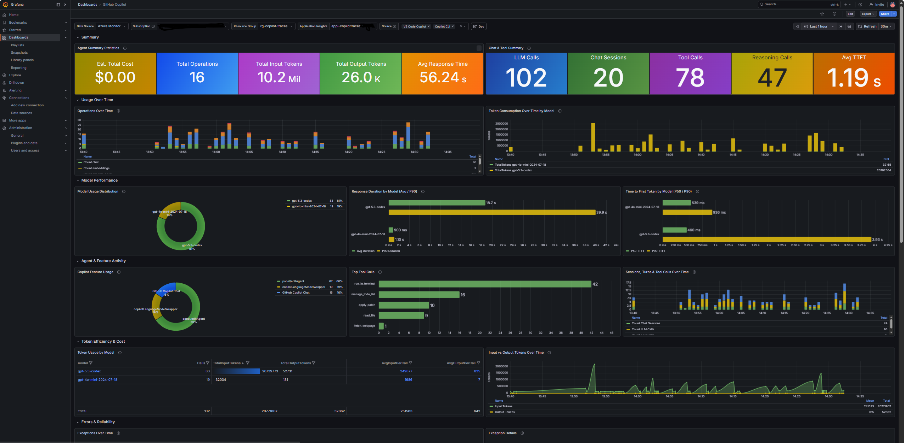

# Azure Setup: Application Insights + Managed Grafana



This folder provides two supported ways to send GitHub Copilot OpenTelemetry data to Azure Monitor and visualize it in Azure Managed Grafana.

## Mode overview

Mode 1: Non-preview (recommended for fastest local setup)
- Collector config: otel-collector-config.yaml
- Auth model: Application Insights connection string
- Best for: quick onboarding from a laptop

Mode 2: Preview native OTLP ingestion
- Collector config: otel-collector-config-otlp-preview.yaml
- Auth model: Microsoft Entra identity (service principal, managed identity, or workload identity)
- Best for: identity-based ingestion with DCR and DCE controls

## Folder structure

- infra/main.bicep: Base infrastructure (LAW, App Insights, Managed Grafana, Grafana RBAC)
- infra/main.parameters.json: Example Bicep parameters
- collector/otel-collector-config.yaml: Mode 1 collector config
- collector/otel-collector-config-otlp-preview.yaml: Mode 2 collector config
- collector/docker-compose.yml: Local collector runtime
- collector/.env.example: Collector environment template
- scripts/provision.ps1: Provision base Azure resources and generate collector .env
- scripts/start-collector.ps1: Start collector in Mode 1 or Mode 2

## Resource inventory

Always required:
- Resource group
- Log Analytics workspace
- Application Insights (workspace-based)
- Azure Managed Grafana
- Managed Grafana role assignment: Monitoring Reader

Required only for Mode 2 (preview native OTLP):
- Azure Monitor workspace
- Data Collection Endpoint (DCE)
- Data Collection Rule (DCR)
- Collector identity role assignment on DCR: Monitoring Metrics Publisher

## Prerequisites

- Azure CLI logged in (az login)
- Docker Desktop running
- VS Code with GitHub Copilot Chat
- Permissions to create resources and role assignments in target subscription

## Script help

PowerShell:

```powershell
Get-Help ./azure-setup/scripts/provision.ps1 -Detailed
Get-Help ./azure-setup/scripts/start-collector.ps1 -Detailed
```

Bash (invoking PowerShell scripts):

```bash
pwsh -File ./azure-setup/scripts/provision.ps1 -?
pwsh -File ./azure-setup/scripts/start-collector.ps1 -?
```

## Common base setup (run once)

Step 1: Provision base Azure resources

PowerShell:

```powershell
./azure-setup/scripts/provision.ps1 -SubscriptionId "<subscription-id>" -ResourceGroup "rg-copilot-traces" -Location "eastus" -NamePrefix "copilottraces"
```

Bash:

```bash
pwsh -File ./azure-setup/scripts/provision.ps1 -SubscriptionId "<subscription-id>" -ResourceGroup "rg-copilot-traces" -Location "eastus" -NamePrefix "copilottraces"
```

This creates:
- Log Analytics workspace
- App Insights (workspace-based)
- Managed Grafana
- Monitoring Reader assignment for Managed Grafana (unless disabled)

It also writes:
- azure-setup/collector/.env

Step 2: Configure Copilot telemetry in VS Code

Open Command Palette and run:
- Preferences: Open User Settings (JSON)

Add:

```json
{
  "github.copilot.chat.otel.enabled": true,
  "github.copilot.chat.otel.exporterType": "otlp-http",
  "github.copilot.chat.otel.otlpEndpoint": "http://localhost:4318",
  "github.copilot.chat.otel.captureContent": false
}
```

Step 3: Generate activity
- Run a few Copilot chat interactions after collector is up.

---

## Mode 1: Non-preview (connection string path)

Use this mode first unless you specifically need preview native OTLP ingestion.

Step 1: Ensure collector .env has Mode 1 values

```env
OTEL_CONFIG_FILE=otel-collector-config.yaml
APPINSIGHTS_CONNECTION_STRING=<value generated by provision.ps1>
```

Step 2: Start collector in Mode 1

PowerShell:

```powershell
./azure-setup/scripts/start-collector.ps1 -Mode nonpreview
```

Bash:

```bash
pwsh -File ./azure-setup/scripts/start-collector.ps1 -Mode nonpreview
```

Step 3: Validate collector health

```bash
docker ps --filter "name=collector-otel-collector-1"
docker logs --tail=100 collector-otel-collector-1
```

Step 4: Validate ingestion in App Insights

Find app id:

```bash
az monitor app-insights component show -g rg-copilot-traces -a <app-insights-name> --query appId -o tsv
```

Query last 30 min:

```bash
az monitor app-insights query --app <app-id> --analytics-query "dependencies | where timestamp > ago(30m) | where cloud_RoleName == 'copilot-chat' | project timestamp, name, resultCode, duration | order by timestamp desc | take 50" -o table
```

Step 5: Open Grafana and import dashboard
- Managed Grafana endpoint is printed by provision.ps1
- Import dashboard: https://aka.ms/amg/dash/gh-copilot

---

## Mode 2: Preview native OTLP ingestion (DCR/DCE path)

Use this mode when you need Entra-authenticated ingestion and DCR/DCE controls.

Important:
- Preview features have no SLA.
- Local Docker collector does not automatically reuse host az login.
- For local Docker, use service principal environment variables.

Step 1: Create preview resources (if not already created)
- Azure Monitor workspace (AMW)
- DCE
- DCR

If using manual Azure portal path, follow Microsoft OTLP ingestion docs and capture:
- DCR resource ID
- DCR immutable ID
- DCE logs ingestion endpoint
- DCE metrics ingestion endpoint

Step 2: Create or choose collector identity
For local Docker, create service principal and capture:
- AZURE_TENANT_ID
- AZURE_CLIENT_ID
- AZURE_CLIENT_SECRET

Step 3: Assign DCR RBAC to collector identity

```bash
az role assignment create --assignee-object-id "<collector-object-id>" --assignee-principal-type ServicePrincipal --role "Monitoring Metrics Publisher" --scope "<dcr-resource-id>"
```

Validate:

```bash
az role assignment list --assignee "<collector-object-id>" --scope "<dcr-resource-id>" --query "[].{role:roleDefinitionName,scope:scope}" -o table
```

Practical way to avoid empty placeholders:

```powershell
$clientId=(Get-Content azure-setup/collector/.env | Where-Object { $_ -match '^AZURE_CLIENT_ID=' } | ForEach-Object { $_.Split('=')[1].Trim() })
$collectorObjectId=(az ad sp show --id $clientId --query id -o tsv)
$dcrId="<dcr-resource-id>"

az role assignment list --assignee $collectorObjectId --scope $dcrId --query "[].{role:roleDefinitionName,scope:scope,principalId:principalId}" -o table
```

Bash equivalent:

```bash
clientId=$(grep '^AZURE_CLIENT_ID=' azure-setup/collector/.env | cut -d'=' -f2)
collectorObjectId=$(az ad sp show --id "$clientId" --query id -o tsv)
dcrId="<dcr-resource-id>"

az role assignment list --assignee "$collectorObjectId" --scope "$dcrId" --query "[].{role:roleDefinitionName,scope:scope,principalId:principalId}" -o table
```

Step 4: Populate collector .env for Mode 2

```env
OTEL_CONFIG_FILE=otel-collector-config-otlp-preview.yaml
AZURE_MONITOR_TRACES_ENDPOINT=https://<logs-dce-domain>/datacollectionRules/<dcr-immutable-id>/streams/Microsoft-OTLP-Traces/otlp/v1/traces
AZURE_MONITOR_LOGS_ENDPOINT=https://<logs-dce-domain>/datacollectionRules/<dcr-immutable-id>/streams/Microsoft-OTLP-Logs/otlp/v1/logs
AZURE_MONITOR_METRICS_ENDPOINT=https://<metrics-dce-domain>/datacollectionRules/<dcr-immutable-id>/streams/Custom-Metrics-Otel/otlp/v1/metrics
AZURE_TENANT_ID=<tenant-id>
AZURE_CLIENT_ID=<client-id>
AZURE_CLIENT_SECRET=<client-secret>
```

Step 5: Start collector in Mode 2

PowerShell:

```powershell
./azure-setup/scripts/start-collector.ps1 -Mode preview
```

Bash:

```bash
pwsh -File ./azure-setup/scripts/start-collector.ps1 -Mode preview
```

Step 6: Validate collector startup and auth

```bash
docker ps --filter "name=collector-otel-collector-1"
docker logs --tail=150 collector-otel-collector-1
```

Expected:
- azure_auth extension starts
- no repeated auth/export errors

Step 7: Validate ingestion in App Insights

```bash
az monitor app-insights query --app <app-id> --analytics-query "dependencies | where timestamp > ago(30m) | where cloud_RoleName == 'copilot-chat' | project timestamp, name, resultCode, duration | order by timestamp desc | take 50" -o table
```

---

## Switching between modes

Use script switching:

PowerShell:

```powershell
./azure-setup/scripts/start-collector.ps1 -Mode nonpreview
./azure-setup/scripts/start-collector.ps1 -Mode preview
```

Bash:

```bash
pwsh -File ./azure-setup/scripts/start-collector.ps1 -Mode nonpreview
pwsh -File ./azure-setup/scripts/start-collector.ps1 -Mode preview
```

Validate config only (no container restart):

PowerShell:

```powershell
./azure-setup/scripts/start-collector.ps1 -Mode nonpreview -ValidateOnly
./azure-setup/scripts/start-collector.ps1 -Mode preview -ValidateOnly
```

Bash:

```bash
pwsh -File ./azure-setup/scripts/start-collector.ps1 -Mode nonpreview -ValidateOnly
pwsh -File ./azure-setup/scripts/start-collector.ps1 -Mode preview -ValidateOnly
```

`start-collector.ps1` performs preflight `.env` validation before startup:
- Mode 1 requires `APPINSIGHTS_CONNECTION_STRING`
- Mode 2 requires `AZURE_MONITOR_*` endpoints and `AZURE_TENANT_ID` / `AZURE_CLIENT_ID` / `AZURE_CLIENT_SECRET`
- If required keys are missing, the script prints warnings and exits before running Docker
- With `-ValidateOnly`, the script stops after validation and makes no runtime changes

Manual override option:
- Set OTEL_CONFIG_FILE in azure-setup/collector/.env
- Restart collector with force recreate

## .env reference (what to set and when)

File path:
- `azure-setup/collector/.env`

How it is used:
- Loaded by `collector/docker-compose.yml` via `env_file`.
- Controls both collector mode selection and credentials/endpoints.

Variables:

| Variable | Required in Mode 1 | Required in Mode 2 | Purpose |
|---|---|---|---|
| `OTEL_CONFIG_FILE` | Yes | Yes | Chooses collector config file (`otel-collector-config.yaml` or `otel-collector-config-otlp-preview.yaml`). |
| `COPILOT_USER_EMAIL` | Optional | Optional | Stamped by the collector onto all exported telemetry as `enduser.id` and `github.copilot.user.email`. |
| `APPINSIGHTS_CONNECTION_STRING` | Yes | Optional | Used by Mode 1 exporter path. Not used by Mode 2 exporter, but kept for convenience. |
| `AZURE_MONITOR_TRACES_ENDPOINT` | No | Yes | Preview traces ingestion endpoint from DCE + DCR immutable ID. |
| `AZURE_MONITOR_LOGS_ENDPOINT` | No | Yes | Preview logs ingestion endpoint from DCE + DCR immutable ID. |
| `AZURE_MONITOR_METRICS_ENDPOINT` | No | Yes | Preview metrics ingestion endpoint from DCE + DCR immutable ID. |
| `AZURE_TENANT_ID` | No | Yes (local Docker) | Entra tenant for service principal auth in preview mode. |
| `AZURE_CLIENT_ID` | No | Yes (local Docker) | Service principal application/client id. |
| `AZURE_CLIENT_SECRET` | No | Yes (local Docker) | Service principal secret for preview mode auth. |

Mode 1 `.env` example (non-preview):

```env
OTEL_CONFIG_FILE=otel-collector-config.yaml
COPILOT_USER_EMAIL=example.user@contoso.com
APPINSIGHTS_CONNECTION_STRING=InstrumentationKey=<key>;IngestionEndpoint=https://<region>.in.applicationinsights.azure.com/;LiveEndpoint=https://<region>.livediagnostics.monitor.azure.com/;ApplicationId=<app-id>
```

Mode 2 `.env` example (preview native OTLP):

```env
OTEL_CONFIG_FILE=otel-collector-config-otlp-preview.yaml
COPILOT_USER_EMAIL=example.user@contoso.com
AZURE_MONITOR_TRACES_ENDPOINT=https://<logs-dce-domain>/datacollectionRules/<dcr-immutable-id>/streams/Microsoft-OTLP-Traces/otlp/v1/traces
AZURE_MONITOR_LOGS_ENDPOINT=https://<logs-dce-domain>/datacollectionRules/<dcr-immutable-id>/streams/Microsoft-OTLP-Logs/otlp/v1/logs
AZURE_MONITOR_METRICS_ENDPOINT=https://<metrics-dce-domain>/datacollectionRules/<dcr-immutable-id>/streams/Custom-Metrics-Otel/otlp/v1/metrics
AZURE_TENANT_ID=<tenant-id>
AZURE_CLIENT_ID=<client-id>
AZURE_CLIENT_SECRET=<client-secret>
```

When to update `.env`:
- After provisioning (new App Insights connection string).
- When you want to stamp telemetry with a specific Copilot user identity.
- When switching modes.
- After rotating service principal secrets.
- After recreating DCR/DCE resources (endpoints or immutable ID changes).

Important:
- Do not commit populated `.env` to source control.
- If you change `.env`, restart collector with recreate:

```bash
docker compose --env-file azure-setup/collector/.env -f azure-setup/collector/docker-compose.yml up -d --force-recreate
```

## Debugging and health-check commands

Use these commands during setup validation and incident triage.

Set your app id once:

PowerShell:

```powershell
$env:APP_ID="<app-insights-app-id>"
```

Bash:

```bash
APP_ID="<app-insights-app-id>"
```

How to find `APP_ID`:

Option A: Azure CLI (recommended)

```bash
az monitor app-insights component show -g <resource-group> -a <app-insights-name> --query appId -o tsv
```

Example with this repo naming:

```bash
az monitor app-insights component show -g rg-copilot-traces -a appi-copilottraces-2651 --query appId -o tsv
```

Then export it:

PowerShell:

```powershell
$env:APP_ID=(az monitor app-insights component show -g <resource-group> -a <app-insights-name> --query appId -o tsv)
```

Bash:

```bash
APP_ID=$(az monitor app-insights component show -g <resource-group> -a <app-insights-name> --query appId -o tsv)
```

Option B: Azure portal

1. Open your Application Insights resource.
2. Go to `Overview`.
3. Copy `Application Id` (this is the same value as `appId` in CLI).

Collector runtime checks:

```bash
docker ps --filter "name=collector-otel-collector-1"
docker logs --tail=150 collector-otel-collector-1
docker inspect collector-otel-collector-1 --format "{{range .Config.Env}}{{println .}}{{end}}" | grep -E "OTEL_CONFIG_FILE|AZURE_MONITOR_|AZURE_CLIENT_ID|AZURE_TENANT_ID"
```

Latest Copilot telemetry (JSON output):

PowerShell:

```powershell
az monitor app-insights query --app "$env:APP_ID" --analytics-query "dependencies | where cloud_RoleName == 'copilot-chat' | top 20 by timestamp desc | project timestamp,name,resultCode" -o json
```

Bash:

```bash
az monitor app-insights query --app "$APP_ID" --analytics-query "dependencies | where cloud_RoleName == 'copilot-chat' | top 20 by timestamp desc | project timestamp,name,resultCode" -o json
```

Recent-window query:

PowerShell:

```powershell
az monitor app-insights query --app "$env:APP_ID" --analytics-query "dependencies | where timestamp > ago(30m) | where cloud_RoleName == 'copilot-chat' | project timestamp,name,resultCode | order by timestamp desc | take 50" -o json
```

Bash:

```bash
az monitor app-insights query --app "$APP_ID" --analytics-query "dependencies | where timestamp > ago(30m) | where cloud_RoleName == 'copilot-chat' | project timestamp,name,resultCode | order by timestamp desc | take 50" -o json
```

Recency summary (fast health signal):

PowerShell:

```powershell
az monitor app-insights query --app "$env:APP_ID" --analytics-query "dependencies | where cloud_RoleName == 'copilot-chat' | summarize lastSeen=max(timestamp), total=count()" -o json
```

Bash:

```bash
az monitor app-insights query --app "$APP_ID" --analytics-query "dependencies | where cloud_RoleName == 'copilot-chat' | summarize lastSeen=max(timestamp), total=count()" -o json
```

If `-o table` appears empty for App Insights query output, flatten the nested payload first:

PowerShell:

```powershell
az monitor app-insights query --app "$env:APP_ID" --analytics-query "dependencies | where cloud_RoleName == 'copilot-chat' | summarize lastSeen=max(timestamp), total=count()" --query "{lastSeen:tables[0].rows[0][0], total:tables[0].rows[0][1]}" -o table
```

Bash:

```bash
az monitor app-insights query --app "$APP_ID" --analytics-query "dependencies | where cloud_RoleName == 'copilot-chat' | summarize lastSeen=max(timestamp), total=count()" --query "{lastSeen:tables[0].rows[0][0], total:tables[0].rows[0][1]}" -o table
```

Reliable output pattern (recommended):

1. Run with `-o json` first to confirm rows exist.
2. If needed, convert to `-o table` with `--query` flattening.

Example:

```bash
az monitor app-insights query --app "$APP_ID" --analytics-query "dependencies | where timestamp > ago(30m) | where cloud_RoleName == 'copilot-chat' | project timestamp,name,resultCode | order by timestamp desc | take 50" -o json
```

Windows note for collector env inspection:

- In Git Bash, `grep` works:

```bash
docker inspect collector-otel-collector-1 --format "{{range .Config.Env}}{{println .}}{{end}}" | grep -E "OTEL_CONFIG_FILE|AZURE_MONITOR_|AZURE_CLIENT_ID|AZURE_TENANT_ID"
```

- In PowerShell, use `Select-String`:

```powershell
docker inspect collector-otel-collector-1 --format "{{range .Config.Env}}{{println .}}{{end}}" | Select-String "OTEL_CONFIG_FILE|AZURE_MONITOR_|AZURE_CLIENT_ID|AZURE_TENANT_ID"
```

Preview mode DCR/DCE verification:

```bash
az monitor data-collection rule show -g <resource-group> -n <dcr-name> --query "{id:id,immutableId:immutableId}" -o json
az monitor data-collection endpoint show -g <resource-group> -n <dce-name> --query "{id:id,logs:logsIngestion.endpoint,metrics:metricsIngestion.endpoint}" -o json
```

Preview mode RBAC verification (collector identity on DCR scope):

```bash
az role assignment list --scope "<dcr-resource-id>" --query "[?roleDefinitionName=='Monitoring Metrics Publisher'].[principalId,roleDefinitionName,scope]" -o table
```

Tip: after changing settings or mode, generate one fresh Copilot prompt before re-running checks.

## Troubleshooting

Port 4317 or 4318 already allocated
- Stop other local stack using those ports
- Example (from repo root if local Tempo stack is running):

```bash
docker compose down
```

No App Insights data
- Verify collector is running
- Verify Copilot settings endpoint is `http://localhost:4318`
- Generate fresh Copilot activity
- Re-run KQL query

Preview mode auth errors
- Confirm AZURE_TENANT_ID, AZURE_CLIENT_ID, AZURE_CLIENT_SECRET in .env
- Confirm collector identity has Monitoring Metrics Publisher on DCR scope
- Confirm endpoint URLs include correct DCR immutable ID and stream names

Security notes
- Do not commit collector secrets (.env) to source control
- Set captureContent to false unless you explicitly need payload content
