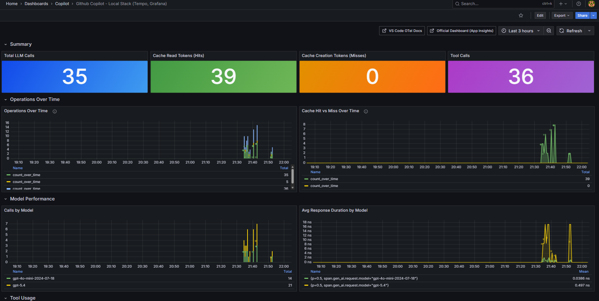

# Copilot OTel Traces to Grafana

Visualize GitHub Copilot's prompt cache behavior using OpenTelemetry traces and Grafana. Runs locally with Docker Compose, no cloud services needed.



[Screen recording demo](docs/Screen-recording-local-tempo.mp4)

## Architecture

```text
VS Code (Copilot OTel)
  └─ OTLP/HTTP :4318 ──> Grafana Tempo

Grafana :3000
  └─ TraceQL :3200 ────> Grafana Tempo
```

- **Grafana Tempo** receives OTLP directly (no collector needed) and stores traces locally. This keeps the demo simple, but it also means you have limited processing capabilities because there is no middleware layer to enrich, redact, transform, sample, or fan out telemetry.
- **Grafana** queries Tempo and displays a pre-built dashboard focused on prompt caching hit/miss.

> [!IMPORTANT]
> **No OTel Collector in this demo.** Traces go directly from VS Code to Tempo for simplicity. That is useful for a fast local setup, but it comes with tradeoffs: no attribute enrichment (for example adding user identity), no centralized filtering/redaction, no routing to multiple backends, and fewer controls for sampling or policy enforcement. In a team or production setting you should insert an [OTel Collector](https://opentelemetry.io/docs/collector/) between VS Code and the backend to enrich, filter, and route telemetry to multiple destinations (for example Application Insights + Tempo).

> [!NOTE]
> **Scaling & enforcement.** If you need to roll this configuration out across an organization (ensuring every developer has the OTel settings enabled and pointing to a central collector), consider using **Microsoft Intune** policies to manage and enforce the VS Code `settings.json` values on managed devices. This ensures all managed devices report telemetry without manual opt-in.

## Quick Start

### 1. Start the stack

```bash
docker compose up -d
```

This brings up:
| Service | Port | Purpose |
|---------|------|---------|
| Tempo   | 4318 | OTLP/HTTP receiver (traces + metrics) |
| Tempo   | 3200 | Tempo query API |
| Grafana | 3000 | Dashboards (login: `admin` / `admin`) |

### 2. Configure VS Code

**Option A — One-click links** (open these in your browser, VS Code will handle them):

| Setting | Link |
|---------|------|
| Open all Copilot OTel settings | [⚙️ Open settings](vscode://settings/github.copilot.chat.otel) |

> These `vscode://settings/` links open the VS Code Settings UI filtered to the relevant setting. You'll need to manually set the values.

**Option B — Copy-paste** into your **User** `settings.json` (`Ctrl+Shift+P` → "Open User Settings (JSON)"):

```json
{
  "github.copilot.chat.otel.enabled": true,
  "github.copilot.chat.otel.exporterType": "otlp-http",
  "github.copilot.chat.otel.otlpEndpoint": "http://localhost:4318",
  "github.copilot.chat.otel.captureContent": false
}
```

> **Important:** Use **User settings**, not Workspace settings. The OTel SDK initializes early in VS Code's startup — workspace settings may load too late. After adding, reload the window (`Ctrl+Shift+P` → "Developer: Reload Window").

Optionally set `captureContent` to `true` to see full prompts/responses (careful with sensitive code).

### 3. Generate traces

Use Copilot Chat (ask a question, run an agent task, invoke tools). Each interaction produces a trace tree:

```
invoke_agent copilot
  ├── chat gpt-4o          ← cache_read.input_tokens & cache_creation.input_tokens here
  ├── execute_tool readFile
  ├── chat gpt-4o
  └── ...
```

### 4. View in Grafana

Open **http://localhost:3000** → Dashboards → **Copilot Prompt Cache & Usage**.

The dashboard includes (adapted from the [official GitHub Copilot Grafana dashboard](https://aka.ms/amg/dash/gh-copilot)):

**Cache-focused (our addition):**
- Cache Read vs Creation tokens over time (hit/miss trend)
- Per-model cache efficiency (bar gauges)
- Cache stat panels (total hits, misses, input/output tokens)

**From official dashboard (adapted to TraceQL):**
- Operations Over Time (chat, invoke_agent, execute_tool)
- Token Consumption Over Time by Model
- Model Usage Distribution (pie chart)
- Response Duration by Model
- Top Tool Calls
- Recent Agent Operations (trace table)
- Reference panel mapping official KQL panels → our TraceQL equivalents

### 5. Explore raw traces

Go to **Explore → Tempo** and run TraceQL queries:

```traceql
{ span.gen_ai.usage.cache_read.input_tokens > 0 }
```

```traceql
{ span.gen_ai.operation.name = "chat" && resource.service.name = "copilot-chat" }
```

## Key OTel Attributes for Prompt Caching

| Attribute | Description |
|-----------|-------------|
| `gen_ai.usage.input_tokens` | Total input tokens for the LLM call |
| `gen_ai.usage.output_tokens` | Output tokens |
| `gen_ai.usage.cache_read.input_tokens` | Tokens served from cache (cache **hit**) |
| `gen_ai.usage.cache_creation.input_tokens` | Tokens written to cache (cache **miss** / creation) |
| `gen_ai.request.model` | Model used |
| `gen_ai.operation.name` | `chat`, `invoke_agent`, `execute_tool` |

**Cache Hit** = `cache_read.input_tokens > 0`  
**Cache Miss** = `cache_creation.input_tokens > 0` (new prompt cached)  
**No Cache** = both are 0 or absent

## Scaling Up

For multi-user / team scenarios, add an OTel Collector between VS Code and Tempo:

```text
VS Code
  └─> OTel Collector
       ├─> Grafana Tempo
       └─> Application Insights (optional)
```

See the [Microsoft guide](https://learn.microsoft.com/en-us/azure/managed-grafana/grafana-opentelemetry-app-insights) for a full collector + Application Insights + Managed Grafana setup.

## Azure Deployment Path

Use [azure-setup/README.md](azure-setup/README.md) for a complete Azure-based setup that provisions:

- Log Analytics + workspace-based Application Insights
- Azure Managed Grafana
- OpenTelemetry Collector bridge (OTLP -> Application Insights)

This path is aligned to the Microsoft Learn guide and is intended for team/production-style monitoring.

## Stopping

```bash
docker compose down -v
```

## References

- [Monitor agent usage with OpenTelemetry (VS Code docs)](https://code.visualstudio.com/docs/agents/guides/monitoring-agents)
- [Monitor AI coding agents with Grafana (Microsoft Learn)](https://learn.microsoft.com/en-us/azure/managed-grafana/grafana-opentelemetry-app-insights)
- [Grafana Tempo OTLP receiver](https://grafana.com/docs/tempo/latest/configuration/#distributor)
- [OTel GenAI Semantic Conventions](https://github.com/open-telemetry/semantic-conventions/blob/main/docs/gen-ai/)
